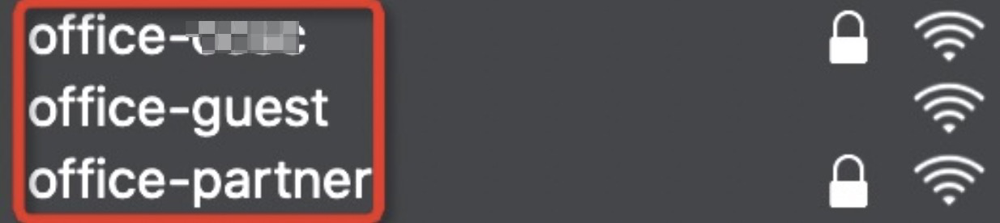

# Sundary WIFI Authentication bypass 0day

## Introduction



This scenario is Sundray (a wholly-owned subsidiary of Sangfor) AP3600 and AC6600. The portal authentication system and AC management WEB system are both the latest. The remaining products are not tested.

The distribution of WIFI is shown in the figure, the beginning of office is office WIFI, among which

- xxxx is for internal employees to use WIFI. After employees use WPA/WPA2 password authentication, they must perform portal authentication on the login page;
  -The guest is open to visitor WIFI, the visitor needs to enter the name and mobile phone number to generate a QR code, and internal employees can scan the QR code to use the WIFI;
  -The partner uses WIFI as a partner, and needs to enter the WPA password for secondary authentication.

## Vulnerability details:

Use the password to connect to the WIFI "office-xxxx", the current ip is 10.3.163.121, and the mac address is 3C-22-FB-07-A4-CA


At this time, any page accessed will jump to the internal employee authentication interface:


Scan the current network segment and find a host as follows:


Modify the mac address of the machine `sudo ifconfig en0 ether A4:C3:F0:C3:9C:B8`

Check the current address and find that ip is automatically assigned to 10.3.163.210


At this time, I visited the wifi authentication interface and found that the portal authentication had been bypassed. The login was successful and entered the intranet!


What's more serious is that when the wifi is connected to the office-guest visitor and the wifi is opened, you can connect without a password at this time. The attacker can scan the network segment and modify the MAC address to bypass authentication.


Modify mac address

```
sudo ifconfig en0 ether 38:BA:F8:32:5C:F8
```


